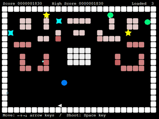
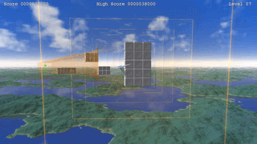


# Loquaty, the language for game scripts

Loquaty は汎用的なスクリプト言語で、「ポインタ型のある Java」、「const のある Java」、「演算子をオーバーロードできる Java」、「try 文に finally 句のある C++」、「安全なポインタしかない C++」等々、他の言語との差異を挙げることはできますが、ゲーム用のスクリプト言語として開発されたその目的のために特に以下の特徴を有します。

* [「軽量で」「安全な」軽量スレッド](#特徴軽量スレッド)
* [C++ との（比較的容易な）インターフェース](#特徴c-とのインターフェース)
* [ポータブル性](#特徴ポータブル性)
* [そこそこ高速](#特徴実行速度)

詳細は、  
⇒ [Loquaty 言語マニュアル](./Loquaty/doc/manual.xhtml)  
⇒ [クラス・リファレンス・マニュアル](./Loquaty/doc/index.xhtml)  


## ファイルとディレクトリ

- `README.md` - このファイル
- `LICENSE` - ライセンス情報
- `build/Loquaty/Loquaty.sln` - Visual Studio 用ソリューション
- [`Loquaty/doc/manual.xhtml`](./Loquaty/doc/manual.xhtml) - 言語マニュアル
- [`Loquaty/doc/index.xhtml`](./Loquaty/doc/index.xhtml) - クラス・リファレンス・マニュアル
- `Loquaty/include/` - C++ 用ヘッダファイル
- `Loquaty/source/` - C++ 用ソースファイル
- `Loquaty/library/win32/` - Win32 用ライブラリ・ビルド出力ディレクトリ
- `Loquaty/library/win64/` - Win64 用ライブラリ・ビルド出力ディレクトリ
- `Loquaty/bin/library/` - Loquaty 用インクルードファイル (LOQUATY_INCLUDE_PATH 環境変数設定推奨)
- `Loquaty/bin/win32/loquaty.exe` - Win32 用 loquaty.exe ビルド出力先
- `Loquaty/bin/win32/plugins/` - Win32 loquaty.exe 用プラグイン・ディレクトリ
- `Loquaty/bin/win64/loquaty.exe` - Win64 用 loquaty.exe ビルド出力先
- `Loquaty/bin/win64/plugins/` - Win64 loquaty.exe 用プラグイン・ディレクトリ
- [`Loquaty/example/SimpleGame/SimpleGame.lqs`](./Loquaty/example/SimpleGame/SimpleGame.lqs) - サンプル簡易ゲーム・スクリプト
- `Loquaty/example/SimpleGame/run.bat` - サンプル簡易ゲーム実行用 bat ファイル (Win64 用)
- [`Loquaty/example/AvoidanceFlight/AvoidanceFlight.lqs`](./Loquaty/example/AvoidanceFlight/AvoidanceFlight.lqs) - サンプルゲーム・スクリプト
- `Loquaty/example/AvoidanceFlight/run.bat` - サンプルゲーム実行用 bat ファイル (Win64 用)


## 使い方 (C++)

インクルード・ディレクトリに `Loquaty/include/` , ライブラリ・ディレクトリに `Loquaty/library/win64/` または `Loquaty/library/win32/` を追加し、

```C++
#include <loquaty.h>
#include <loquaty_lib.h>

using namespace Loquaty ;
```

をインクルード

```C++
LPtr<LVirtualMachine> vm( new LVirtualMachine ) ;
vm->Initialize() ;

// スクリプト 'script_file.lqs' 読み込み
LCompiler compiler( *vm ) ;
compiler.IncludeScript( L"script_file.lqs" ) ;

// 関数 funcName() 実行
LPtr<LThreadObj> thread( new LThreadObj( vm->GetThreadClass() ) ) ;
auto [value, exception] =
    thread->SyncCallFunctionAs( LObjPtr(), L"funcName", nullptr, 0 ) ;
```

で実行できます。

スクリプトのインクルードパスの設定や、あるいは独自の書庫や圧縮ファイルなどから入力することもできます。

詳細は `build/LoquatyCLI` (loquaty.exe) や `build/ExamplePlugin` を参照。


## サンプル・スクリプト

### [SimpleGame.lqs](./Loquaty/example/SimpleGame/SimpleGame.lqs)




### [AvoidanceFlight](./Loquaty/example/AvoidanceFlight/AvoidanceFlight.lqs)




## 特徴：軽量スレッド

軽量スレッドは現代では様々な言語で実装された機能です。  
ゲーム開発において、オブジェクトや敵などの動きを軽量スレッドを用いて記述できると便利です。  
例えば「１秒待ってから」「しばらく動く」ような動作は Loquaty では次のように記述し

```
Task tsk = Task{
    Thread.sleep( 1000 ) ;
    for ( int i = 0; i < 60; ++ i )
    {
        move() ;      // １フレーム分動く
        Task.rest() ;
    }
} ;
```

１フレーム分の動作を記述するタイマー関数などの中で次のように

```
void onTimer()
{
    tsk.proceed() ;
}
```

proceed 関数を呼び出すことによって１フレーム分の処理を実行することができます（C++ 側から利用する場合にも同様です）。  
これだけでも随分処理の見通しが良くなって便利です、が、しかしこれだけでは不満です。  
  
ゲームではオブジェクトや敵を破壊できます。  
その際、実行中の軽量スレッドを外部から安全に強制終了させられると便利です。  
Loquaty では finish 関数を呼び出すと安全に強制終了させられます。  

```
void onDestroy()
{
    tsk.finish() ;
}
```


## 特徴：C++ とのインターフェース

Loquaty はゲームで使用するスクリプト言語が最大の目的ですので、Loquaty 自体に大量の機能をビルトインするのではなく、C++ で記述されたゲームの実装を Loquaty スクリプトから呼び出しやすくすることに重点が置かれています。  
  
C++ 言語とやり取りをする場合、大きく二つの方法があり、その一つが NativeObject を利用する方法です。  
  
例えば C++ で記述された次のようなクラスがあったとします。  

```C++
class Hoge : public Loquaty::Object
{
public:
    void foo() ;
}
```

この Hoge クラスを Loquaty 上で利用したい場合、まず Loquaty スクリプト上でも次のようにクラスを定義しておきます。  

```
class Hoge extends NativeObject
{
    public native Hoge() ;
    public native void foo() ;
}
```

そして呼び出しを仲介するスタブを C++ で以下のように記述します。  

```C++
// 宣言
DECL_LOQUATY_CONSTRUCTOR(Hoge);
DECL_LOQUATY_FUNC(Hoge_foo);

// 実装
IMPL_LOQUATY_CONSTRUCTOR(Hoge)
{
    LQT_FUNC_ARG_LIST;
    LQT_FUNC_THIS_INIT_NOBJ( Hoge, pThis, () ) ;     // Hoge() を構築して NativeObject に設定
}

IMPL_LOQUATY_FUNC(Hoge_foo)
{
    LQT_FUNC_ARG_LIST ;
    LQT_FUNC_THIS_NOBJ( Hoge, pThis ) ;

    pThis->foo() ;

    LQT_RETURN_VOID() ;
}
```

このようにすれば Loquaty スクリプト上から C++ で記述された Hoge を利用できます。  

> ※ C++ 用のスタブコードは loquaty.exe コマンドラインツールで出力できるため、作業を簡略化できます  
> ※ Loquaty スクリプト側で Hoge オブジェクトを生成しない場合にはコンストラクタは必要ありません  
  
NativeObject の他に、より簡単な方法として構造体を利用することができます。  
例えば Loquaty 上で次のような構造体を定義したとします。  

```
struct Huga
{
    int     a, b, c ;
    double d ;
}
```

C++ 側でも同じように構造体を定義します。  

```C++
struct Huga
{
    LInt     a, b, c ;
    LDouble  d ;
}
```

そして Huga 構造体をやり取りする何か Hoge.boo 関数があったとしましょう。  

```
class Hoge extends NativeObject
{
    public static native Huga* boo( Huga* p ) ;
}
```

例えばこの関数は C++ で次のように実装できます。  

```C++
DECL_LOQUATY_FUNC(Hoge_boo);

IMPL_LOQUATY_FUNC(Hoge_boo)
{
    LQT_FUNC_ARG_LIST ;
    LQT_FUNC_ARG_STRUCT( Huga, p ) ;
    LQT_VERIFY_NULL_PTR( p ) ;      // p==nullptr なら NullPointerException 例外送出

    p->a ++ ;           // 渡されたポインタの先を変更

    Huga h = *p ;       // 複製された別の Huga
    h.d *= -2.0 ;

    LQT_RETURN_POINTER_STRUCT(h) ;  // 新しいメモリを確保して複製を返却
}
```

ここでは省略しますが、もちろん渡された引数 p を返却できますし、実のところ C++ 側では受け取ったポインタを利用するだけであれば構造体でなく、

```
class Huga
{
    public int     a, b, c ;
    public double  d ;
}
```

のように通常のクラスでも、まったく同じように受け取ってメンバ変数の値を参照したり変更したりできます（但しオブジェクト変数が存在する場合や派生して親クラスの変数も存在する場合などには注意が必要です）。  


## 特徴：ポータブル性

Loquaty は基本的に外部の依存性が少なく、現バージョンにおいては C++17 ランタイムのみに依存するポータブルなライブラリです。  
  
厳密にはごく一部 POSIX 関数や Windows 関数などを呼び出している箇所があります。  
特にファイルインターフェースについてはデフォルトでは C++ 標準の filesystem を利用せず Windows や POSIX 関数を利用していますが、マクロスイッチによって C++ 標準に切り替えられますし、あるいは独自に実装したファイルインターフェースを利用することもできます。  

> ※ C++ 標準の filesystem を利用しない理由は、機能的な不足や未定義の動作（ファイルのタイムスタンプを必ずしも正常に取得できない）が存在するためです。  
> それに Android では C++ の filesystem は利用できませんが POSIX 関数は利用できたりします。  
  
従って大抵のアプリケーションに組み込んで利用することができます。  
  

## 特徴：実行速度

現バージョンの Loquaty は JIT コンパイラを搭載していないため、他の JIT コンパイラを有する言語には速度面で劣るものの、JIT コンパイラを有さない言語と比較すると大差ないか、条件によっては Loquaty のほうが多少高速な場合もあります。  
そのためほとんどの場面で処理速度を気にせず利用できます。  
  

## ライセンス

Copyright 2024-2025 Leshade Entis (理影).

Licensed under the Apache License, Version 2.0 (the “License”);
you may not use this file except in compliance with the License.
You may obtain a copy of the License at
http://www.apache.org/licenses/LICENSE-2.0

Unless required by applicable law or agreed to in writing, software
distributed under the License is distributed on an “AS IS” BASIS,
WITHOUT WARRANTIES OR CONDITIONS OF ANY KIND, either express or implied.

See the License for the specific language governing permissions and
limitations under the License.
